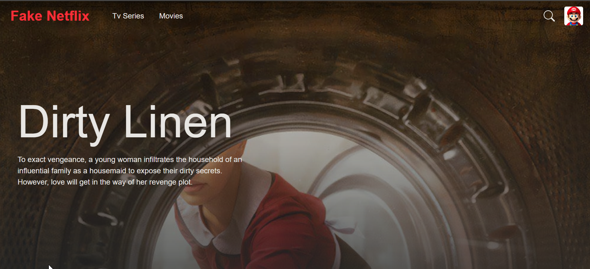
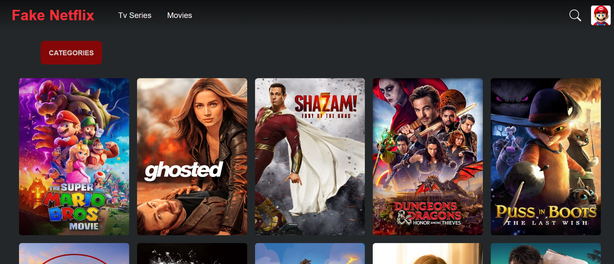
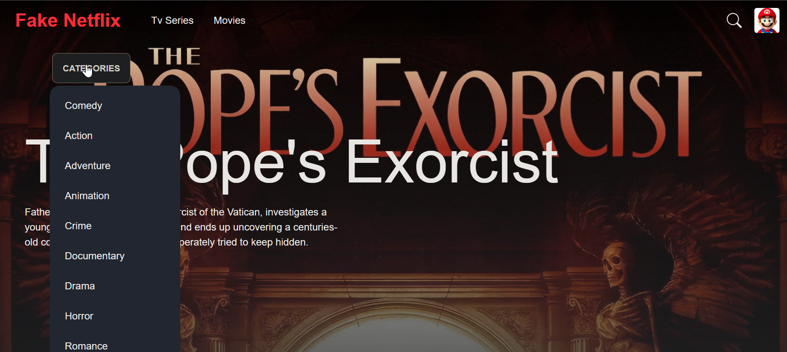

# Netflix Clone

This project is a fully responsive movie and TV series catalog built with React, TailwindCSS, and daisyUI. The app fetches data from The Movie Database (TMDB) API and features filters by genre, search by name, and infinite scrolling.

## Features

- Filter movies and TV series by genre
- Search movies and TV series by name
- Infinite scrolling (fetches more data as you scroll down)
- Fully responsive design

## Instalation

To run this project on your machine follow these steps:

1. Clone the repo using: `git clone https://github.com/Kurler3/netflix-clone.git`

2. Run `npm install`

3. Go to the TMDB website, create an account and get an API key.

4. Create a .env file in the root of the project and add the key "TMDB_KEY" and paste your API key there.

5. Run `npm run dev`.

## Tech Stack

- React
- TailwindCSS
- daisyUI
- Redux Toolkit
- TMDB API

## Screenshots

### Home Page

### Comedy Movies

### Movies Category Dropdown

